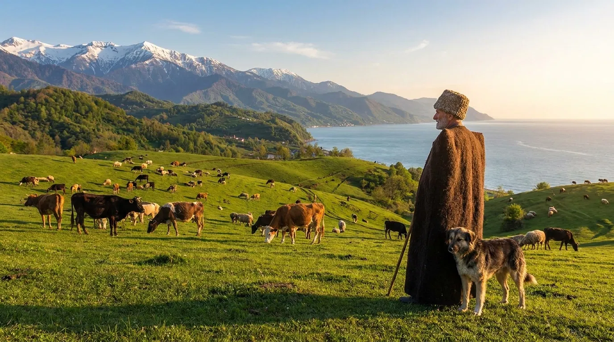
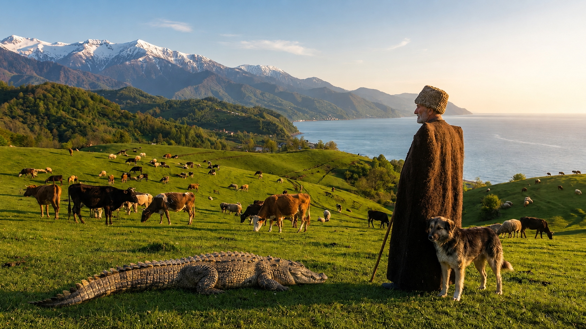
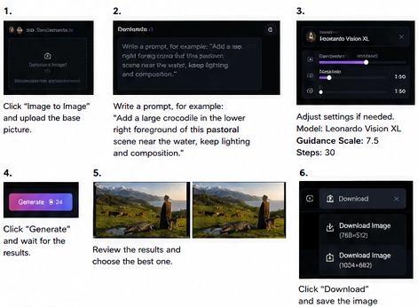
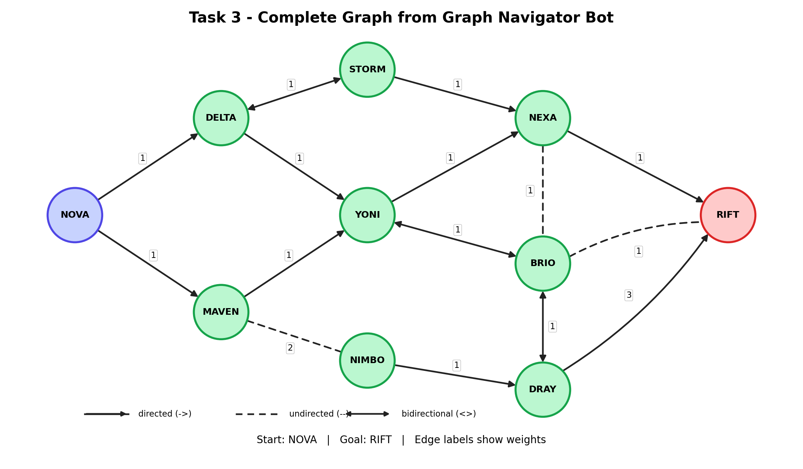

# Introduction to AI - Final Exam Answers

**Student:** Nikoloz Dgebuadze  
**Program:** Computer Science  
**Date:** July 7, 2026

---

## Task 1. Using Generative AI

The original picture was edited with a generative AI image editing tool to add a crocodile into the landscape.

### Original picture



### Final result with crocodile added



---

## Task 2. Creating User Manual

### User manual: How to add a crocodile to the picture using Leonardo.ai

This manual explains how to create the image from Task 1 by signing up for Leonardo.ai, uploading the original picture, and using the image editing feature to add a crocodile.

### 1. Sign up for Leonardo.ai


1. Open the Leonardo.ai website at `https://app.leonardo.ai`.
2. Click **Sign Up**.
3. Enter your email address and create a password.
4. Confirm your email address by opening the verification email and clicking the verification link.
5. Return to Leonardo.ai and log in with your email and password.
6. After logging in, you should arrive at the Leonardo.ai dashboard.

### 2. Upload the original image

1. From the dashboard, choose the image editing option, such as **Image to Image**, **Canvas**, or **Edit Image**.
2. Click the upload area.
3. Select the original picture file from your computer.
4. Wait until the image preview is visible inside the editor.

### 3. Write the editing prompt

In the prompt field, write a clear instruction that describes what object should be added, where it should appear, and how it should match the scene.

Example prompt:

```text
Add a large realistic crocodile in the lower foreground of this pastoral mountain landscape. The crocodile should be on the grass near the small water area. Keep the original lighting, camera angle, colors, and composition natural.
```

### 4. Adjust generation settings

Recommended settings:

- **Model:** Leonardo Vision XL
- **Guidance scale:** around 7.5
- **Steps:** around 30
- **Style:** realistic or photorealistic

These settings help the generated crocodile blend naturally with the original landscape.

### 5. Generate and review the result



1. Click **Generate**.
2. Wait for the tool to create the edited image.
3. Review the generated versions.
4. Choose the version where the crocodile looks realistic and fits the lighting of the original image.
5. Download the selected result in the highest available resolution.

### 6. Initial and final images used in the manual

Initial image:


Final result:


### Tips for better results

- Mention the exact location of the object, for example: “lower foreground” or “near the water.”
- Ask the AI to preserve the original lighting and camera angle.
- Use realistic wording if the goal is a believable final image.
- Regenerate if the first result looks unnatural.
- Download the best result and insert it into `answer.md` using Markdown image syntax.

---

## Task 3. Finding the Graph

The complete graph discovered from the graph bot is shown below.



### Graph details

**Start node:** `NOVA`  
**Goal node:** `RIFT`

### Nodes

`NOVA`, `DELTA`, `MAVEN`, `STORM`, `YONI`, `NIMBO`, `NEXA`, `BRIO`, `DRAY`, `RIFT`

### Transitions

| From | Type | To | Weight |
|---|---:|---|---:|
| NOVA | -> | DELTA | 1 |
| NOVA | -> | MAVEN | 1 |
| DELTA | <> | STORM | 1 |
| DELTA | -> | YONI | 1 |
| MAVEN | -> | YONI | 1 |
| MAVEN | -- | NIMBO | 2 |
| STORM | -> | NEXA | 1 |
| YONI | -> | NEXA | 1 |
| YONI | <> | BRIO | 1 |
| NIMBO | -> | DRAY | 1 |
| NEXA | -> | RIFT | 1 |
| BRIO | -- | RIFT | 1 |
| DRAY | -> | RIFT | 3 |
| NEXA | -- | BRIO | 1 |
| BRIO | <> | DRAY | 1 |

Legend:

- `->` means a directed transition.
- `--` means an undirected transition.
- `<>` means a bidirectional transition.

---

## Task 4. Build a Web Application

The GPA calculator web application is implemented as a single HTML file with embedded CSS and JavaScript.

**File location in the repository:**

```text
gpa/index.html
```

### Implemented requirements

1. The page automatically displays a table with the columns `course`, `credit`, `grade`, and `passed`.
2. The table includes all courses from the transcript, including completed, failed, and currently in-progress courses.
3. Five additional Computer Science program courses are added at the bottom of the table. They are marked with `*`, have grade `100`, credit `6`, and passed value `Yes`.
4. The program name **Computer Science** is clearly displayed at the top of the page.
5. The GPA information icon opens a translated English version of the Ilia State University GPA calculation rule.
6. The **Calculate** button calculates GPA from the courses shown on the screen, using only courses with `passed = Yes`.
7. The **Calculate with Introduction to AI** button assumes that the final score for Introduction to Artificial Intelligence is:

```text
current accumulated points + 30 final exam points = 69 + 30 = 99
```

8. GPA is calculated using the official formula:

```text
GPA = Σ(GP × Credit) / Σ(Credit)
```

9. The final GPA is rounded to one decimal place, according to the Ilia State University rule.

